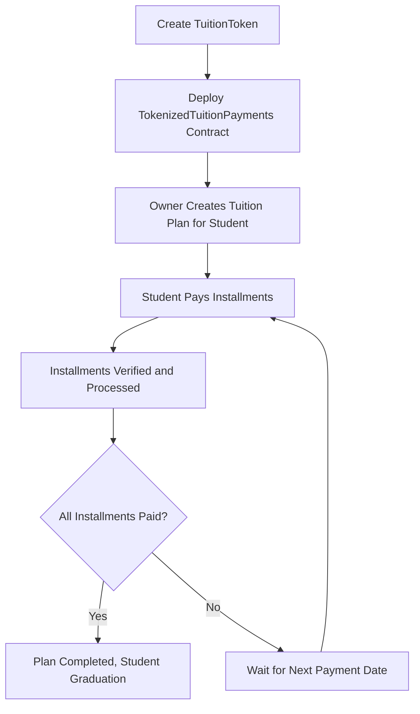

# Tokenized Tuition Payments

## Vision
The **Tokenized Tuition Payments** project aims to revolutionize the way educational institutions manage tuition payments. By leveraging blockchain technology and ERC20 tokens, this system allows students to pay their tuition in a decentralized, transparent, and secure manner. The goal is to provide a seamless payment experience that ensures accountability and automation of the entire tuition payment process.

## Flowchart

## Contracts

### TuitionToken.sol
This contract defines the `TuitionToken` (TUT), an ERC20 token that represents the currency used for tuition payments. Upon deployment, an initial supply of tokens is minted to the deployer's address.

### TokenizedTuitionPayments.sol
This contract manages the entire lifecycle of a tuition plan:
- **Creating Tuition Plans**: Only the owner (e.g., an educational institution) can create a tuition plan for a student. The plan includes the total amount, number of installments, and the installment amount.
- **Paying Installments**: Students can pay their tuition in installments using `TuitionToken`. The contract tracks the number of installments paid and verifies payment dates.
- **Completion**: Once all installments are paid, the contract marks the plan as complete.

### Contract Deployment Address
- **TuitionToken Contract**: `0x39D5b48d91865611192B7A7a47DeE3e2142EABBF`
- **TokenizedTuitionPayments Contract**: `0x39D5b48d91865611192B7A7a47DeE3e2142EABBF`

## Future Scope
- **Multi-Currency Support**: Integrating other stablecoins to offer flexibility in payment methods.
- **Tuition Loan Integration**: Collaborate with financial institutions to offer tuition loans directly through the platform.
- **Student Dashboard**: A web-based interface where students can track their payment progress, view upcoming installment dates, and manage their accounts.
- **Smart Contract Auditing**: Regular smart contract audits to ensure the security and reliability of the system.

## Contact Information
For further inquiries or collaboration opportunities, please reach out:
- **Name**: Rahul MIshra
- **Email**: avaantivirus2021@gmail.com
- **LinkedIn**: https://www.linkedin.com/in/rahul-mishra-9a8826269/
- **GitHub**: https://github.com/machinelearningprodigy

---

This project is licensed under the MIT License. For more details, refer to the LICENSE file included in the repository.
